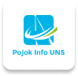

# <p align="center">Pojok Info UNS </p>
<p align="center">
    
</p>


## Kelompok 2 PPL Semester 6 Informatika UNS 2024
| Nama                          | Keanggotaan                  | NIM         |
|  --------                     |  -------                     |  -----------|
| Aditia Prasetya Nugraha       | Dev Team                     | M0521004    |
| Salomo Polanco                | Dev Team                     | M0521068    |
| Tri Yulianto                  | Scrum Master & Dev Team      | M0521077    |
| Wahyu Ariyadi                 | Product Owner & Dev Team     | M0521079    |
| Andreas Domenico Situmorang   | Dev Team                     | M0521083    |

## Dokumentasi
 
- [Design Figma - Pojok Info UNS](https://www.figma.com/file/xdODLSiAlw35saBiaBK3B0/Pojok-Info-UNS?type=design&node-id=0%3A1&mode=design&t=41hE2vs4QKIHBgZY-1)

- [System Request - Pojok Info UNS](https://docs.google.com/document/d/1J0F5CSvTL8rHQTPoXFfsizFsQMN3MAoIAp45zEfgLew/edit#heading=h.zh5gkavq1ml8)


## Cara Replikasi App

To replicate this project on your local machine, follow these steps:

1. Clone repositori:

    ```bash
    git clone https://github.com/Adztrz/PojokInfoUNS.git
    ```

2. Masuk ke direktori proyek:

    ```bash
    cd PojokInfoUNS
    ```

3. Instal dependensi:

    ```bash
    composer install
    npm install
    ```
  

4. Konfigurasi environment variables:

    - Buat `.env` di direktori root.
    - Tambahkan environment variables yang diperlukan, seperti detail koneksi database, dll..

5. Generate key aplikasi:

    ```bash
    php artisan key:generate
    ```

6. Migrasi database:

    ```bash
    php artisan migrate
    ```

7. Jalankan server:


    ```bash
    npm run dev
    php artisan serve
    ```

8. Open your web browser and visit `http://localhost:8000` to view the application.

## Lisensi

The Laravel framework is open-sourced software licensed under the [MIT license](https://opensource.org/licenses/MIT).


